# Тестування працездатності системи

## Засоби тестування
Тестування CRUD застосунку здійснюється за допомогою онлайн інструменту Postman. Перед тестуванням запитів на локальному сервері необхідно встановити Postman Agent.

### Отримання інформації по всім User-ам

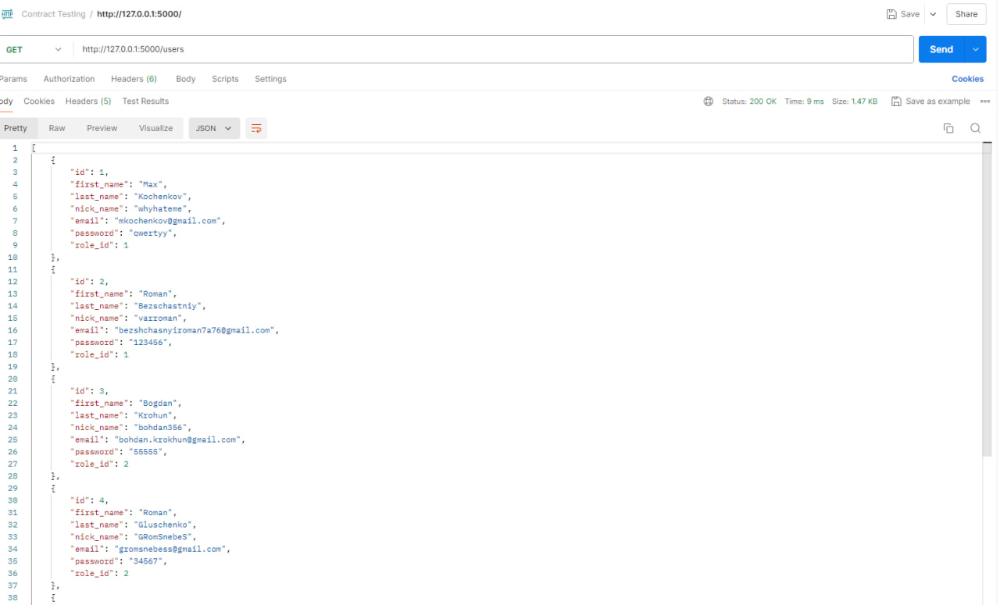

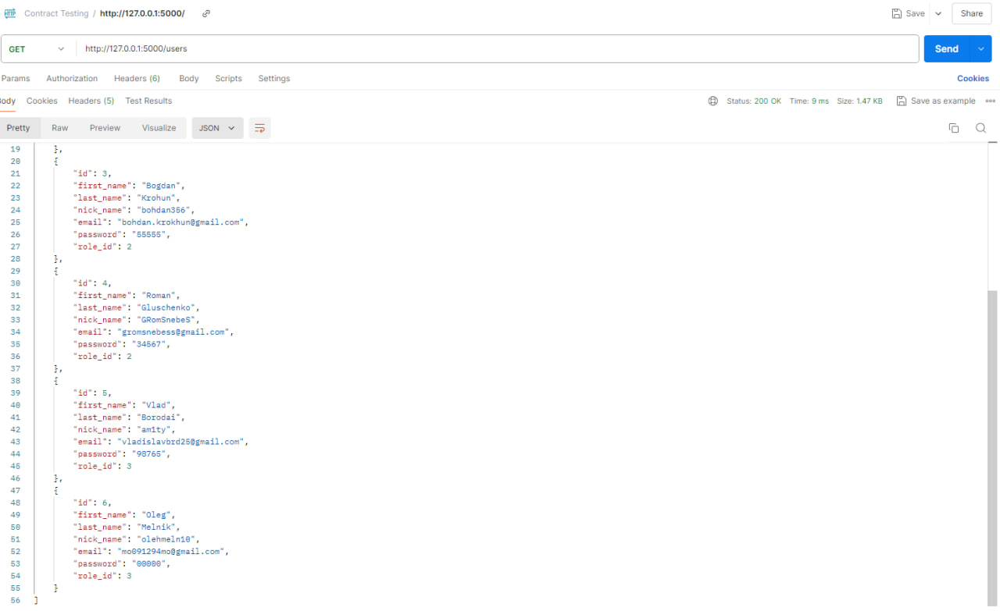

### Отримання інформації по id User-а

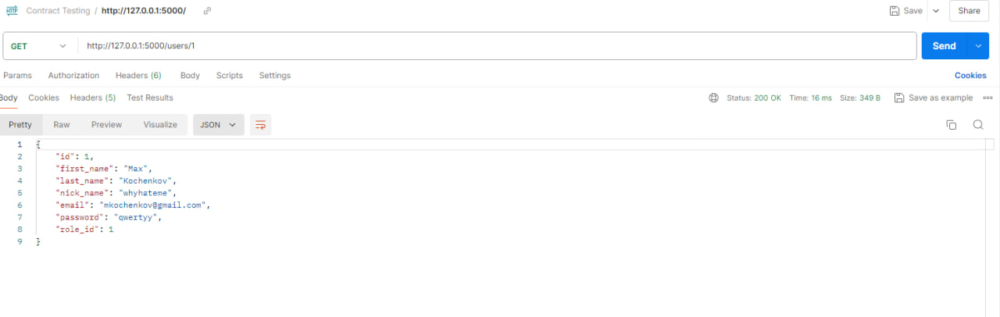

### Створення нового юзера

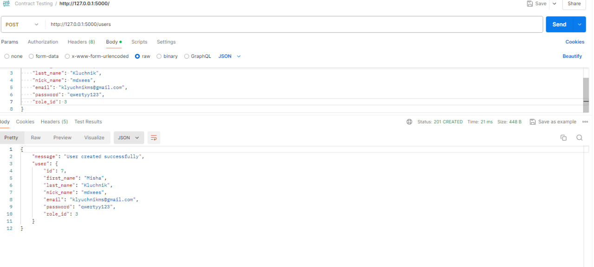

### Вміст таблиці 'User' у базі 'quiz' даних після видалення юзеру

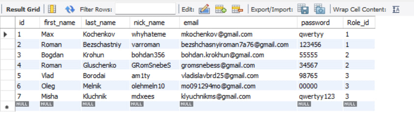

### Помилка створення юзера по причині: "Пошта вже існує"

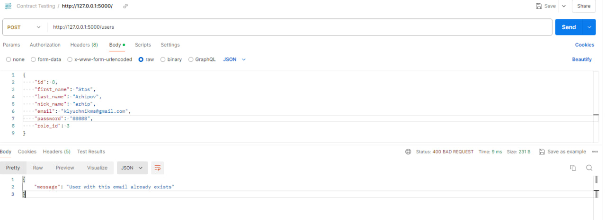

### Помилка створення юзера по причині: "Такий нікнейм вже існує"

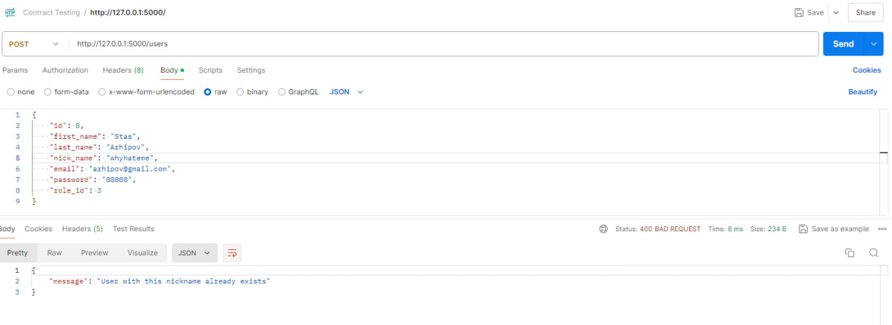

### Видалення юзеру

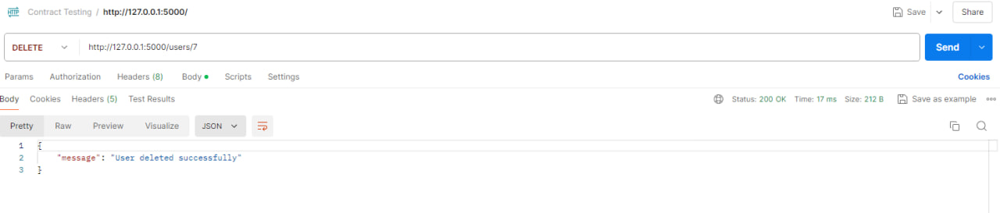

### Помилка видалення юзеру по причині: "Такого юзеру не знайдено"

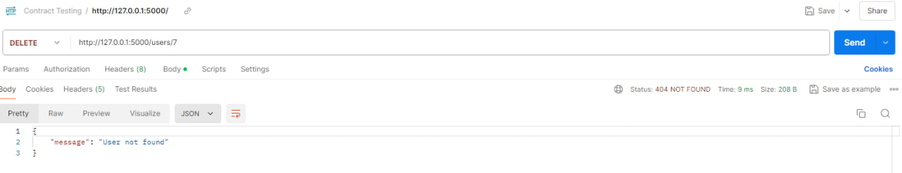

### Вміст таблиці 'User' у базі 'quiz' даних після видалення юзеру

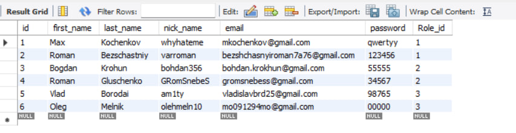

### Оновлення юзеру

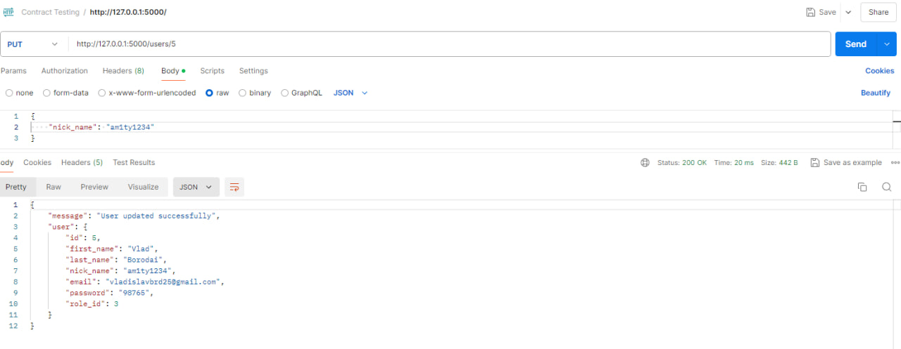

### Вміст таблиці 'User' у базі 'quiz'  даних після виконання усіх операцій

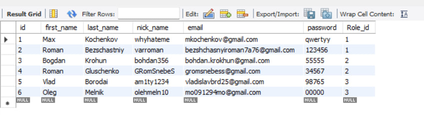